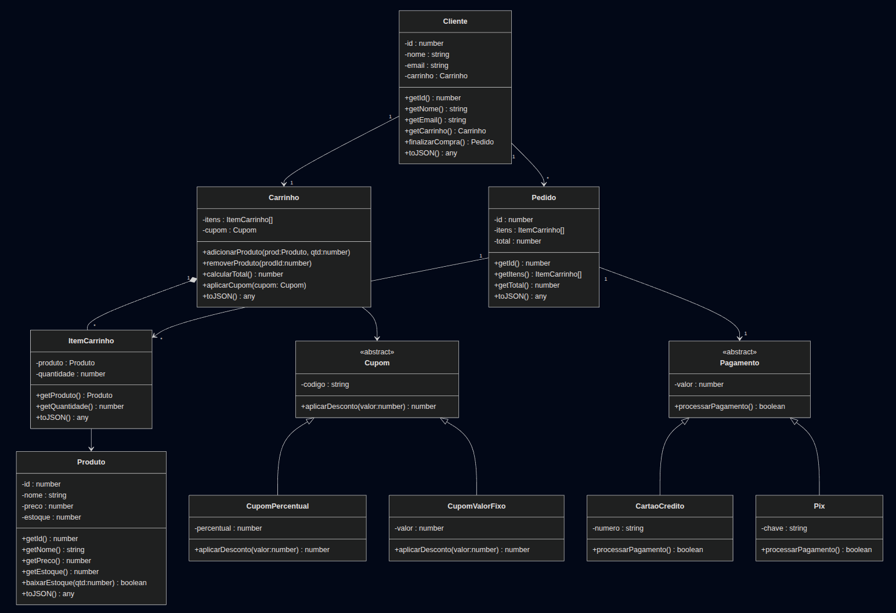

# 🛒 Sistema de E-commerce em TypeScript


## 📖 Descrição do Projeto
Este projeto implementa a **lógica de negócios de um sistema de e-commerce** em TypeScript, utilizando os princípios da **Programação Orientada a Objetos (POO)**.  
O foco está em um **modelo de domínio robusto e bem estruturado**, que poderia servir como base para aplicações front-end ou back-end.

## 🎯 Objetivos
- Aplicar **Encapsulamento**, **Herança**, **Polimorfismo** e **Abstração**.
- Modelar um sistema de **clientes, produtos, carrinhos e pedidos**.
- Garantir **regras de negócio** como controle de estoque, cálculo de totais e aplicação de cupons de desconto.
- Implementar **serialização** com `toJSON()` para simular integração com APIs.

---

## 🏗️ Decisões de Design

- **Encapsulamento Forte**:  
  Todos os atributos são privados (`private`) e só podem ser acessados via **getters e setters com validação**.


- **Composição e Associação**:
    - `Cliente` possui **1 Carrinho** e pode ter **N Pedidos**.
    - `Carrinho` contém **N ItensCarrinho** (Composição).
    - `Pedido` é gerado a partir do carrinho e mantém associação com `Produto`.


- **Herança e Polimorfismo**:
    - Criada a classe abstrata `Cupom` com subclasses `CupomPercentual` e `CupomValorFixo`.
    - Criada a classe abstrata `Pagamento` com subclasses `CartaoCredito` e `Pix`.


- **Métodos de Negócio**:
    - `Carrinho`: `adicionarProduto`, `removerProduto`, `calcularTotal`, `aplicarCupom`.
    - `Produto`: `baixarEstoque`, `reporEstoque`.
    - `Cliente`: `finalizarCompra`.


- **Serialização**:
    - Todas as classes implementam `toJSON()` para simular persistência/transmissão de dados.

---

## 🚀 Como Executar

Clone o repositório:
```bash
  git clone https://github.com/luanasousasilva/Front_End_ADA.git
```
Instale as dependências:
```bash
  npm install
```
Execute o arquivo de demonstração:
```bash
 Caso tenha clonado o repositório completo do GitHub:
 
   npx ts-node Programação Orientada a Objeto/Minha Loja/src/index.ts
  
 Caso possua apenas os arquivos locais (sem a estrutura completa do GitHub)

   npx ts-node src/index.ts
```
---

## 📊 Diagrama UML

O diagrama UML do sistema foi construído em **UML** e está disponível no arquivo:



